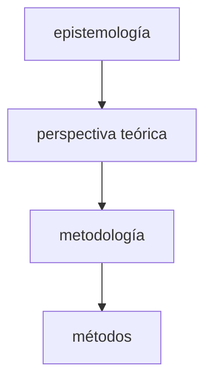
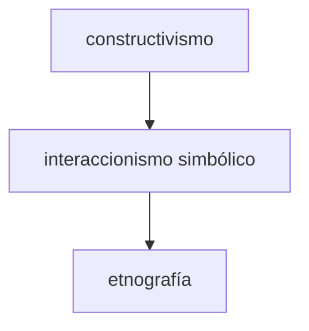

## Resumen esquemático
### cuatro elementos del proceso de investigación

¿Qué metodologías y métodos serán usados en la investigación y cómo justificar el uso de esas metodologías y métodos? 

La respuesta involucra una aproximación teórica porque involucra una realidad leída. También involucra el conocimiento y la forma en la que lo definimos.

Los cuatro elementos son:

1. Métodos: las técnicas o procedimientos usados para recolectar y analizar datos sobre la pregunta de investigación o las hipótesis
2. Metodología: la estrategia, el plan de acción, proceso o diseño que vincula los métodos con los resultados que se quieren
3. Perspectiva teórica: el posicionamiento filosófico que informa a la metodología a por tanto provee de contexto al proceso y fundamente sus lógicas y criterios
4. Epistemología: La teoría del conocimiento involucrada en la perspectiva teórica y por lo tanto en la metodología

Constuctivismo, Interaccionismo simbólico y etnografía suelen aparecer como perspectivas intercambiables a nivel investigación, sin embargo cada uno está ubicado a un nivel diferente

Todos los elementos deben estar adecuadamente vinculados entre sí para mantener la coherencia de la investigación

### ontología

Los aspectos ontológicos y epistemológicos tieden a emerger juntos, puesto que ambos involucran dimensiones sobre una realidad significativa (*ser* y *mundo*)

La propia noción del sujeto que investiga obliga a asumir la existencia de *seres capaces de dar sentido*, puesto que sin esta condición, aunque sea posible concebir el universo, no necesariamente sería posible concebirlo como *universo con sentido* 

#### Tipos de ontologías

El positivismo afirma un universo hecho de eventos observables, discretos y atómicos.

El 'interpretativismo' afirma un universo en que la realidad social es producto de procesos donde el sentido es negociado para cada acción y situación dada

**Las perspectivas teóricas transforman y son combinables con las metodologías y los métodos.** Puede haber una etnografía crítica:

- Etnografía postmoderna
- Etnografía feminista

No se comienza con la abstracción teórica, sino con un problema observable en el mundo, y de ahí comenzamos a pensar en el cómo (metodología) y desde qué mirada y noción de la verdad

Hay que aprender de las metodologías que ya existen y cómo se han aplicado

- Investigación cualitativa y cuantitativa  ≠ postivismo/objetivismo e constructivismo/subjetivismo

Hay investigación cualitativa fuertemente ligada al empirismo (epistemología objetiva)

Es posible usar metodologías cuantitativas con una persepectiva construccionista que reconozca su utilidad a la vez que sus limitaciones (a un dominio de conocimiento particular al que sirven, el conocimiento científico, que no es el único ni el último en generalización)

## Referencias

Crotty, M. (1998). The foundations of social research: Meaning and perspective in the research process. Sage.
